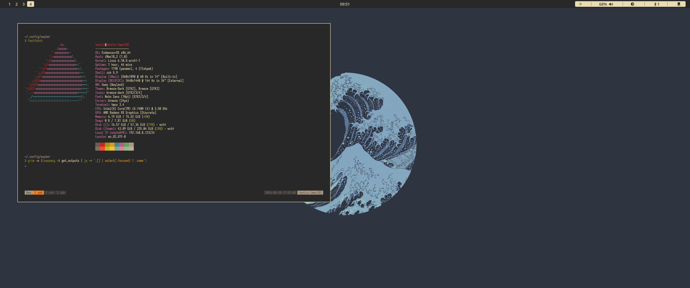

# Waybar Semi-Self-Made Configs

Semi made **Waybar** configs with its respective screenshots

### Personal_Test
This was just the first config I started working on at the beggining, essentially I did not knew that much about it and how it was configured #to-do *Take bar screenshot*

### Personal+ziap [ziap's GitHub dotfiles repo](https://github.com/ziap/dotfiles)
Almost a copy paste of ziap's waybar, I did changed a few things such as the bar `padding` and such, this is a very simple bar. Something I still not able to comprehend is the way he set up the `.module-right` variable

### Desktop Preview

